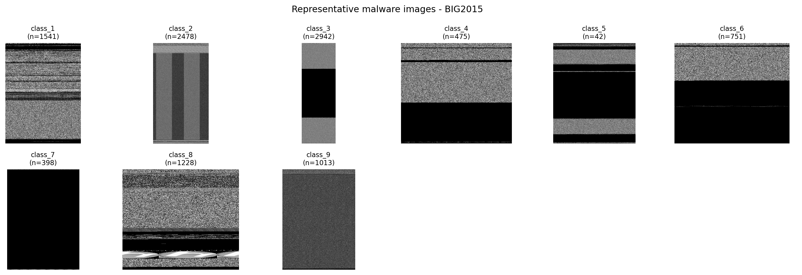
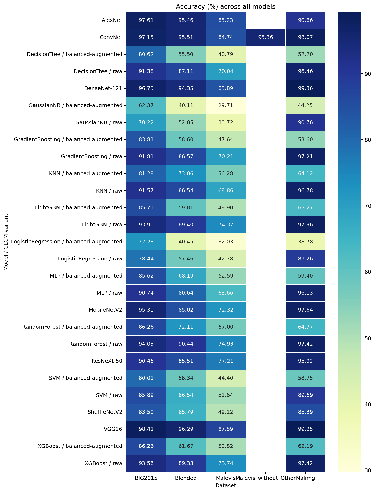
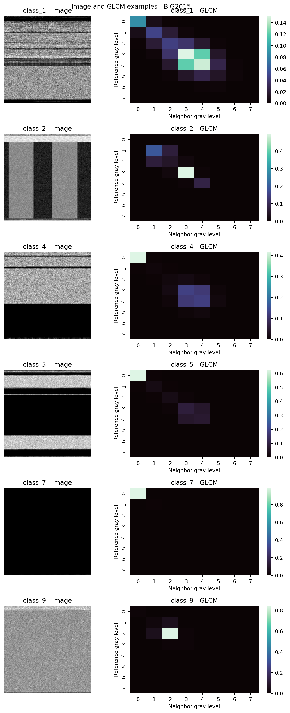
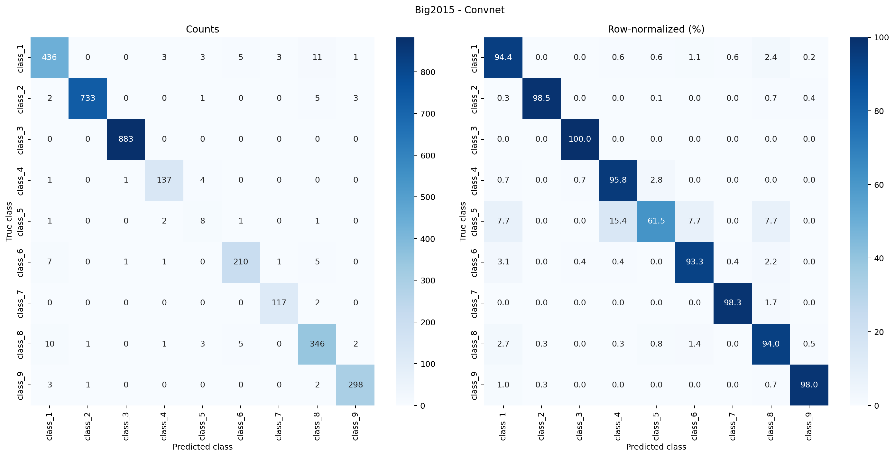

# VBDN Malware Image Classification

An image-based, multi-class malware classification pipeline based on:

> Y. Liu, H. Fan, J. Zhao, J. Zhang, and X. Yin, “Efficient and Generalized Image-Based CNN
> Algorithm for Multi-Class Malware Detection,” *IEEE Access*, vol. 12, pp. 104317–104332,
> 2024. [DOI: 10.1109/ACCESS.2024.3435362](https://doi.org/10.1109/ACCESS.2024.3435362)

A local copy of the publication is available at [`docs/paper.pdf`](docs/paper.pdf).

The paper proposes **VBDN**, a framework that combines malware visualization, balanced sampling,
image augmentation, and a compact convolutional network. This implementation also compares VBDN
with ImageNet-pretrained networks and classical classifiers trained on GLCM texture features.

## Repository layout

| Path | Contents |
|---|---|
| `src/vbdn/` | Installable Python package and CLI implementation |
| `docs/paper.pdf` | Reference paper |
| `docs/results.md` | Detailed reproduction results and analysis |
| `docs/images/` | Figures used by the project documentation |
| `pyproject.toml` | Package metadata, command entry point, and tool configuration |
| `requirements.txt` | Runtime dependencies |

## Method

Malware bytes are mapped to grayscale intensities in `[0, 255]` and arranged as images. Programs
from the same malware family often produce similar textures and structural patterns, allowing image
classifiers to distinguish them without executing or disassembling the samples.

The repository supports three experiment families:

| Pipeline | Models |
|---|---|
| VBDN-style CNN | Three-layer custom ConvNet |
| Transfer learning | VGG16, AlexNet, DenseNet-121, MobileNetV2, ResNeXt-50, ShuffleNetV2 |
| GLCM texture classification | Logistic Regression, Gaussian NB, KNN, Decision Tree, Random Forest, GBDT, SVM, MLP, XGBoost, LightGBM |

The custom ConvNet uses three `3x3` convolutional layers with 32, 64, and 128 channels, `2x2`
pooling, global average pooling, and two linear layers. Imbalanced datasets use inverse-frequency
weighted sampling, while random flips and rotations provide augmentation.



These are byte plots, not screenshots or executed malware. Their bands, low-entropy regions, and
textures are the patterns used for classification.

## Installation

Python 3.10 is required. A CUDA-capable GPU is recommended for full experiments.

```bash
git clone https://github.com/ta-tahmasebi/VBDN.git
cd VBDN

python3 -m venv .venv
source .venv/bin/activate          # Windows: .venv\Scripts\Activate.ps1
python -m pip install --upgrade pip
python -m pip install -r requirements.txt
python -m pip install -e .

python -m vbdn --help
# The installed equivalent is: malware-cli --help
```

BIG2015 conversion also requires `7z` or `7zz`:

```bash
sudo apt install p7zip-full   # Ubuntu/Debian
# macOS: brew install sevenzip
# Windows: install 7-Zip and add it to PATH
```

## Datasets

| Dataset | Classes | Split used here | Download |
|---|---:|---|---|
| Malimg | 25 | 8,408 train / 931 test | Automatic through KaggleHub |
| MaleVis | 26 | Supplied 9,100 train / 5,126 validation | Automatic through KaggleHub |
| Blended | 31 | Supplied 9,868 train / 3,879 validation | Automatic through KaggleHub |
| BIG2015 | 9 | Stratified 70/30: 7,607 train / 3,261 test | Manual Kaggle competition download |

Malimg, MaleVis, and Blended are downloaded on first use and cached under
`~/.cache/kagglehub/datasets/`. Use `--no-download` to require an existing cached copy. Custom
datasets can be passed as ImageFolder-compatible directories with one subdirectory per class.

MaleVis and Blended use their supplied validation directories without mixing them into training.
The available Malimg archive contains 9,339 images—four fewer than the total in the paper—so the
paper's 8,408 training samples are retained and the remaining 931 are used for testing.

### Preparing BIG2015

BIG2015 is distributed through the
[Microsoft Malware Classification Challenge](https://www.kaggle.com/competitions/malware-classification/data).

1. Sign in to Kaggle and accept the competition rules.
2. Download `train.7z` and `trainLabels.csv`; the `.asm` and test archives are not required.
3. Put both files in the same directory. The default is `~/.cache/kaggle/BIG2015/main/`.
4. Convert the archived `.bytes` files to PNG images:

```bash
python -m vbdn prepare-big2015 \
  --source ~/.cache/kaggle/BIG2015/main \
  --workers 6
```

The converter streams one file at a time from the archive and never extracts the complete
`train.7z`. Existing images are skipped, failures are recorded in `conversion_manifest.csv`, and
an interrupted conversion can be resumed safely.

```bash
# Balanced conversion smoke test
python -m vbdn prepare-big2015 --source /data/BIG2015 --samples-per-class 4

# Write images to another disk
python -m vbdn prepare-big2015 \
  --source /data/BIG2015 \
  --output /mnt/ssd/BIG2015-images

# Train with that image directory
python -m vbdn convnet --datasets BIG2015 \
  --big2015-path /data/BIG2015 \
  --big2015-images /mnt/ssd/BIG2015-images
```

Use `--limit N` for a global prefix, `--samples-per-class N` for a balanced subset, and
`--overwrite` to rebuild existing images. BIG2015 is large, so keep both the archive and generated
images on a volume with sufficient free space.

> **Safety:** BIG2015 `.bytes` files are hexadecimal text dumps. This project only converts them
> into images. Never execute malware samples, and use an isolated research environment when
> required by your organization.

## Running experiments

Start with a small end-to-end check:

```bash
python -m vbdn run-all \
  --epochs 1 \
  --max-samples-per-class 4 \
  --big2015-samples-per-class 4 \
  --no-save-models
```

Typical commands:

```bash
python -m vbdn convnet --datasets Malimg
python -m vbdn pretrained --datasets Malevis --models VGG16 MobileNetV2
python -m vbdn glcm --datasets Blended
python -m vbdn run-all --no-download
python -m vbdn run-all --paper-settings
```

The standard `run-all` profile uses 224-pixel images, 80 ConvNet epochs, and 18 pretrained-model
epochs. `--paper-settings` selects the paper's disclosed 512-pixel input, 200 epochs, SGD learning
rate 0.01, momentum 0.5, seed 50, and paper batch sizes. It is substantially more expensive.

The GLCM pipeline evaluates `raw` and `balanced-augmented` variants by default. Run only one with
`--glcm-variants raw`. GLCM uses 256 gray levels by default; `--glcm-levels 32` or `8` reduces
memory use. See `python -m vbdn <command> --help` for all options.

## Results

The following results are from `results/csv/all_models__summary.csv`. They were produced with
the standard resource-safe profile, not the full 200-epoch paper profile.

The complete tables, charts, and comparison with the paper are available in
[the detailed results report](docs/results.md).

| Dataset | ConvNet | Best pretrained | Best raw GLCM |
|---|---:|---:|---:|
| Malimg | 98.07% | DenseNet-121: 99.36% | LightGBM: 97.96% |
| BIG2015 | 97.15% | VGG16: 98.41% | Random Forest: 94.05% |
| MaleVis | 84.74% | VGG16: 87.59% | Random Forest: 74.93% |
| Blended | 95.51% | VGG16: 96.29% | Random Forest: 90.44% |
| MaleVis without `Other` | 95.36% | — | — |

### Comparison with the paper

| Dataset | Paper VBDN | This ConvNet | Difference |
|---|---:|---:|---:|
| Malimg | 94.22% | 98.07% | +3.85 pp |
| BIG2015 | 96.19% | 97.15% | +0.96 pp |
| MaleVis | 83.22% | 84.74% | +1.52 pp |
| MaleVis without `Other` | 96.76% | 95.36% | -1.40 pp |
| Blended | 91.39% | 95.51% | +4.12 pp |

These are descriptive rather than exact replication comparisons: image size, epoch count,
available archives, software, and hardware differ. MaleVis also contains a disproportionately large
`Other` validation class. Its removal raises the reproduced ConvNet accuracy from 84.74% to 95.36%,
which is why both results are reported separately.



### GLCM examples

The six GLCM statistics are contrast, dissimilarity, homogeneity, energy, correlation, and ASM.
In the stored experiments, raw GLCM features consistently outperformed features extracted after
image augmentation; geometric augmentation can distort the texture statistics used by these small
classical models.



### Per-class analysis

The row-normalized confusion matrix exposes errors hidden by overall accuracy. For example, the
BIG2015 ConvNet reaches 97.15% overall accuracy, while class 5 has only 61.5% recall.



## Output files

All generated artifacts are written under the ignored `results/` directory:

| Path | Contents |
|---|---|
| `results/csv/` | Per-family and cross-model summaries |
| `results/reports/` | JSON metrics and per-class reports |
| `results/predictions/` | Sample-level predictions and class scores |
| `results/plots/` | Galleries, learning curves, confusion matrices, ROC/PR curves, feature importance, and comparison charts |
| `results/models/` | CNN checkpoints |
| `results/cache/` | Cached GLCM features |
| `results/last_run.json` | Platform, Python version, seed, and CLI arguments |

Selected figures are copied to `docs/images/` so they remain visible on GitHub while the large
`results/` directory stays out of version control.

## Reproducibility

- Dataset splits are stratified and deterministic with seed 50.
- BIG2015 uses a 70/30 split because its labeled training release has no official test split.
- `--paper-settings` reproduces disclosed hyperparameters, not undocumented implementation details.
- Hardware, CUDA, PyTorch, data-loader settings, and pretrained weights can affect timing and small
  numerical differences.

## Citation

```bibtex
@article{liu2024vbdn,
  author  = {Yajun Liu and Hong Fan and Jianguang Zhao and Jianfang Zhang and Xinxin Yin},
  title   = {Efficient and Generalized Image-Based CNN Algorithm for Multi-Class Malware Detection},
  journal = {IEEE Access},
  volume  = {12},
  pages   = {104317--104332},
  year    = {2024},
  doi     = {10.1109/ACCESS.2024.3435362}
}
```
