# Complete Comparison of Reproduction Results with the VBDN Paper

## Reading Guide

* `Δ Accuracy` equals “our result minus the paper’s value” and its unit is **percentage points (pp)**; a positive value means our accuracy is higher.
* `Δ Time` equals the relative change in “our training time” compared with the paper’s `Time` column; a negative value means our saved run was shorter.
* The paper’s `Time` column is copied exactly from Table 3, but the paper sometimes describes it in the text as execution/testing time and sometimes as training time. Therefore, `Δ Time` is only a descriptive comparison, not a hardware-controlled benchmark.
* In Table 2 of the paper, only the **accuracy** of seven GLCM models is reported. Although the paper’s text also mentions LightGBM, SVM, and MLPC, no numerical values are printed in the table for these three models; they have not been omitted from this report, and the paper’s corresponding cells are marked with `—`.
* `balanced-augmented` and `raw` are two branches of our experiments. The paper describes the use of balanced sampling and augmentation, but does not provide enough detail for a bit-for-bit match with either of these two branches.
* The accuracy value of **13.70% for VGG16/BIG2015** is quoted exactly from Table 3 of the paper. This value is inconsistent with the trend of the other results and is likely a typographical error; it has not been corrected without an additional source.

## Differences in Settings and Data

| Component      | Paper                                                 | Our saved run                             | Effect on comparison                                                     |
| -------------- | ----------------------------------------------------- | ----------------------------------------- | ------------------------------------------------------------------------ |
| CNN image size | 512×512                                               | 224×224                                   | Time and accuracy are not directly comparable under identical conditions |
| epoch          | 200                                                   | ConvNet: 80; pretrained: 18               | Our time is inherently shorter                                           |
| batch          | Training 64/testing 32; Table 3 mentions a value of 8 | ConvNet: 32/16; pretrained: 4/16          | The timing protocol is ambiguous and different                           |
| Learning rate  | 0.01                                                  | Model head 0.01; backbone equal to 0.0001 | The pretrained models use different settings                             |
| seed           | 50                                                    | 50                                        | Identical                                                                |
| GLCM           | 6 features; size/levels not reported                  | 128×128 and 256 grayscale levels          | Exact reproduction is not possible                                       |
| Hardware       | i5-10600KF, RAM 32GB, RTX 3060                        | Not recorded in the CSV                   | A definitive timing comparison is not possible                           |

### Sample Coverage

| Dataset               | Paper training                 | Paper testing                  | Our training | Our testing | Description                                                |
| --------------------- | ------------------------------ | ------------------------------ | ------------ | ----------- | ---------------------------------------------------------- |
| Malimg                | 8408                           | 935                            | 8408         | 931         | Our archive contains 4 fewer images                        |
| BIG2015               | 10868                          | 0 in Table 1                   | 7607         | 3261        | The paper later explains a 70/30 split; our total is 10868 |
| MaleVis               | 9100                           | 5126                           | 9100         | 5126        | Identical                                                  |
| MaleVis without Other | No separate breakdown reported | No separate breakdown reported | 8750         | 3644        | Only our ConvNet is available                              |
| Blended               | 9867                           | 3879                           | 9868         | 3879        | Our training set has one additional sample                 |

## 1. Deep Models: Accuracy and Time

The paper values are from Table 3 (page 14 of the PDF). Exception: for ConvNet on MaleVis including the `Other` class, the value 83.22 is taken from Figure 11/the paper text; Table 3 uses the value 96.76 for the case where `Other` is removed.

### Malimg

| Model        | Paper accuracy (%) | Our accuracy (%) | Δ Accuracy | Paper Time (s) | Our training (s) | Δ Time* | Our evaluation (s) | Paper improvement over ConvNet | Our evaluation improvement over ConvNet | Scope                                 |
| ------------ | ------------------ | ---------------- | ---------- | -------------- | ---------------- | ------- | ------------------ | ------------------------------ | --------------------------------------- | ------------------------------------- |
| ConvNet      | 94.22              | 98.07            | +3.85 pp   | 10069.97       | 1472.39          | -85.38% | 1.77               | —                              | —                                       | Same dataset name; different protocol |
| VGG16        | 85.67              | 99.25            | +13.58 pp  | 92080.03       | 3975.68          | -95.68% | 5.77               | 89.15%                         | 69.22%                                  | Same dataset name; different protocol |
| AlexNet      | 90.03              | 90.66            | +0.63 pp   | 14925.47       | 762.15           | -94.89% | 1.71               | 32.54%                         | -3.63%                                  | Same dataset name; different protocol |
| DenseNet-121 | 95.36              | 99.36            | +4.00 pp   | 53317.17       | 1484.06          | -97.22% | 2.63               | 81.11%                         | 32.40%                                  | Same dataset name; different protocol |
| MobileNetV2  | 93.71              | 97.64            | +3.93 pp   | 19923.96       | 607.71           | -96.95% | 1.72               | 49.45%                         | -3.40%                                  | Same dataset name; different protocol |
| ResNeXt-50   | 94.03              | 95.92            | +1.89 pp   | 59163.44       | 2209.84          | -96.26% | 3.43               | 82.98%                         | 48.21%                                  | Same dataset name; different protocol |
| ShuffleNetV2 | 90.30              | 85.39            | -4.91 pp   | 13280.06       | 475.17           | -96.42% | 1.67               | 24.18%                         | -6.31%                                  | Same dataset name; different protocol |

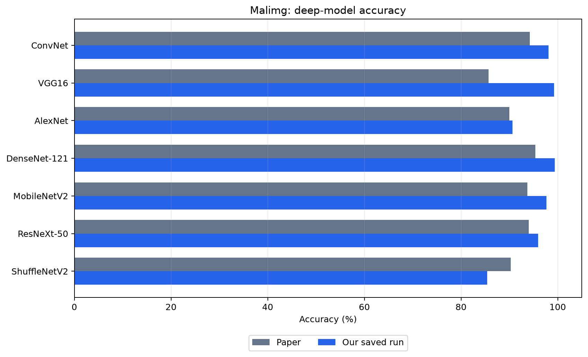

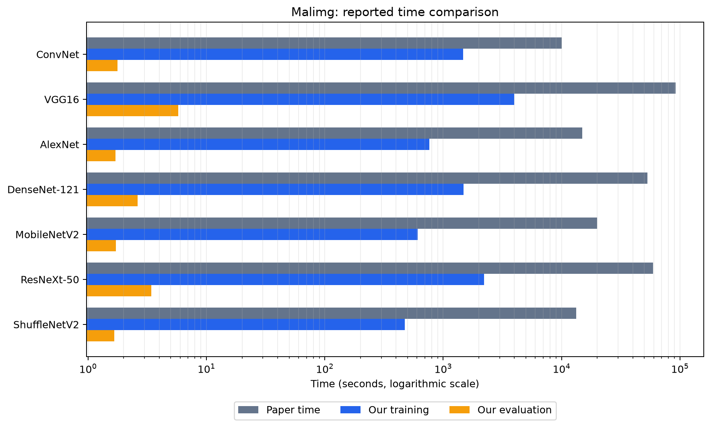

Additional quality metrics from our run

| Model        | Balanced Acc. (%) | Macro P | Macro R | Macro F1 | Weighted F1 | MCC   | Kappa |
| ------------ | ----------------- | ------- | ------- | -------- | ----------- | ----- | ----- |
| ConvNet      | 93.91             | 0.937   | 0.939   | 0.937    | 0.975       | 0.977 | 0.977 |
| VGG16        | 98.04             | 0.981   | 0.980   | 0.980    | 0.992       | 0.991 | 0.991 |
| AlexNet      | 94.25             | 0.905   | 0.943   | 0.910    | 0.897       | 0.899 | 0.891 |
| DenseNet-121 | 98.35             | 0.985   | 0.983   | 0.983    | 0.994       | 0.992 | 0.992 |
| MobileNetV2  | 93.10             | 0.932   | 0.931   | 0.926    | 0.970       | 0.973 | 0.972 |
| ResNeXt-50   | 89.13             | 0.906   | 0.891   | 0.883    | 0.951       | 0.952 | 0.952 |
| ShuffleNetV2 | 85.89             | 0.863   | 0.859   | 0.824    | 0.840       | 0.837 | 0.829 |

### BIG2015

| Model        | Paper accuracy (%) | Our accuracy (%) | Δ Accuracy | Paper Time (s) | Our training (s) | Δ Time* | Our evaluation (s) | Paper improvement over ConvNet | Our evaluation improvement over ConvNet | Scope                                 |
| ------------ | ------------------ | ---------------- | ---------- | -------------- | ---------------- | ------- | ------------------ | ------------------------------ | --------------------------------------- | ------------------------------------- |
| ConvNet      | 96.19              | 97.15            | +0.96 pp   | 63603.29       | 2451.35          | -96.15% | 18.49              | —                              | —                                       | Same dataset name; different protocol |
| VGG16        | 13.70              | 98.41            | +84.71 pp  | 112406.22      | 3611.70          | -96.79% | 21.34              | 43.45%                         | 13.35%                                  | Same dataset name; different protocol |
| AlexNet      | 94.52              | 97.61            | +3.09 pp   | 104448.56      | 716.27           | -99.31% | 18.88              | 39.11%                         | 2.04%                                   | Same dataset name; different protocol |
| DenseNet-121 | 93.17              | 96.75            | +3.58 pp   | 117057.16      | 1380.06          | -98.82% | 19.14              | 45.65%                         | 3.37%                                   | Same dataset name; different protocol |
| MobileNetV2  | 92.17              | 95.31            | +3.14 pp   | 105207.88      | 709.03           | -99.33% | 18.26              | 39.55%                         | -1.29%                                  | Same dataset name; different protocol |
| ResNeXt-50   | 95.43              | 90.46            | -4.97 pp   | 107543.06      | 2062.16          | -98.08% | 18.80              | 40.86%                         | 1.61%                                   | Same dataset name; different protocol |
| ShuffleNetV2 | 95.03              | 83.50            | -11.53 pp  | 109635.93      | 643.85           | -99.41% | 20.30              | 42.00%                         | 8.89%                                   | Same dataset name; different protocol |

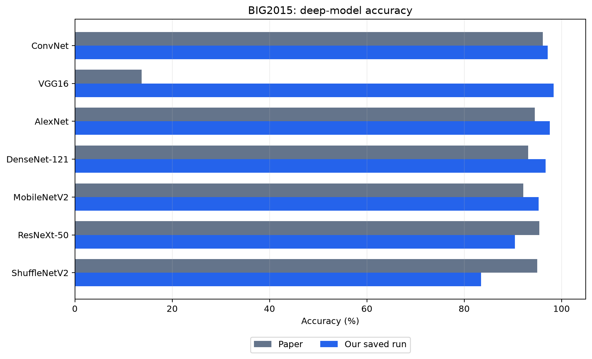

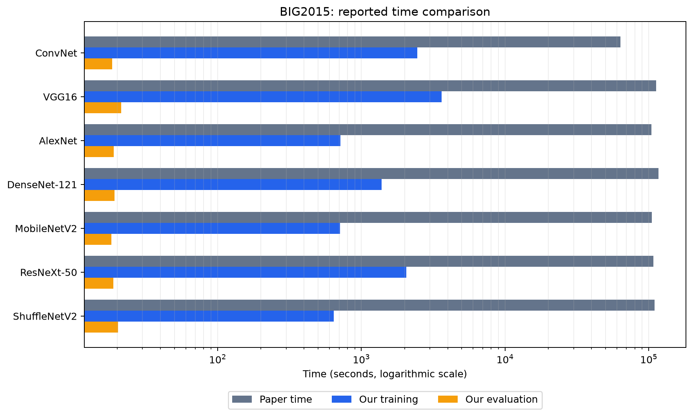

Additional quality metrics from our run

| Model        | Balanced Acc. (%) | Macro P | Macro R | Macro F1 | Weighted F1 | MCC   | Kappa |
| ------------ | ----------------- | ------- | ------- | -------- | ----------- | ----- | ----- |
| ConvNet      | 92.66             | 0.905   | 0.927   | 0.914    | 0.972       | 0.965 | 0.965 |
| VGG16        | 98.35             | 0.952   | 0.984   | 0.966    | 0.984       | 0.981 | 0.981 |
| AlexNet      | 96.76             | 0.948   | 0.968   | 0.957    | 0.976       | 0.971 | 0.971 |
| DenseNet-121 | 96.12             | 0.924   | 0.961   | 0.940    | 0.968       | 0.961 | 0.961 |
| MobileNetV2  | 95.57             | 0.893   | 0.956   | 0.917    | 0.954       | 0.944 | 0.943 |
| ResNeXt-50   | 90.88             | 0.845   | 0.909   | 0.869    | 0.907       | 0.887 | 0.885 |
| ShuffleNetV2 | 80.14             | 0.708   | 0.801   | 0.723    | 0.838       | 0.804 | 0.802 |

### Malevis

| Model        | Paper accuracy (%) | Our accuracy (%) | Δ Accuracy | Paper Time (s) | Our training (s) | Δ Time* | Our evaluation (s) | Paper improvement over ConvNet | Our evaluation improvement over ConvNet | Scope                                               |
| ------------ | ------------------ | ---------------- | ---------- | -------------- | ---------------- | ------- | ------------------ | ------------------------------ | --------------------------------------- | --------------------------------------------------- |
| ConvNet      | 83.22              | 84.74            | +1.52 pp   | 16539.89       | 1550.29          | -90.63% | 10.43              | —                              | —                                       | With Other; paper time corresponds to without Other |
| VGG16        | 86.51              | 87.59            | +1.08 pp   | 91834.41       | 4281.92          | -95.34% | 32.01              | 82.00%                         | 67.42%                                  | Paper: apparently without Other; ours: with Other † |
| AlexNet      | 90.12              | 85.23            | -4.89 pp   | 18782.83       | 825.63           | -95.60% | 10.43              | 11.92%                         | 0.05%                                   | Paper: apparently without Other; ours: with Other † |
| DenseNet-121 | 96.70              | 83.89            | -12.81 pp  | 20466.65       | 1582.63          | -92.27% | 14.03              | 19.18%                         | 25.69%                                  | Paper: apparently without Other; ours: with Other † |
| MobileNetV2  | 95.83              | 72.32            | -23.51 pp  | 20466.65       | 649.88           | -96.82% | 10.44              | 19.18%                         | 0.17%                                   | Paper: apparently without Other; ours: with Other † |
| ResNeXt-50   | 93.18              | 77.21            | -15.97 pp  | 60597.31       | 2431.36          | -95.99% | 19.31              | 72.72%                         | 46.00%                                  | Paper: apparently without Other; ours: with Other † |
| ShuffleNetV2 | 92.69              | 49.12            | -43.57 pp  | 18860.12       | 523.32           | -97.23% | 10.70              | 12.31%                         | 2.59%                                   | Paper: apparently without Other; ours: with Other † |

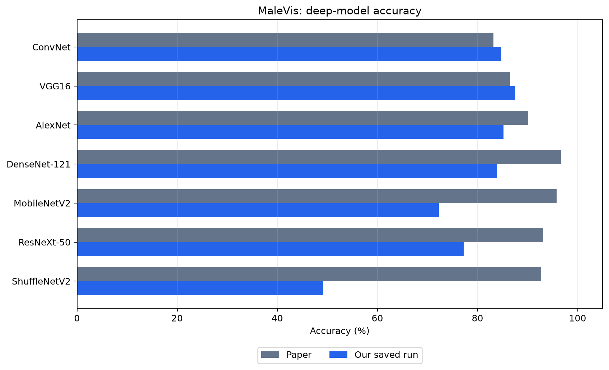

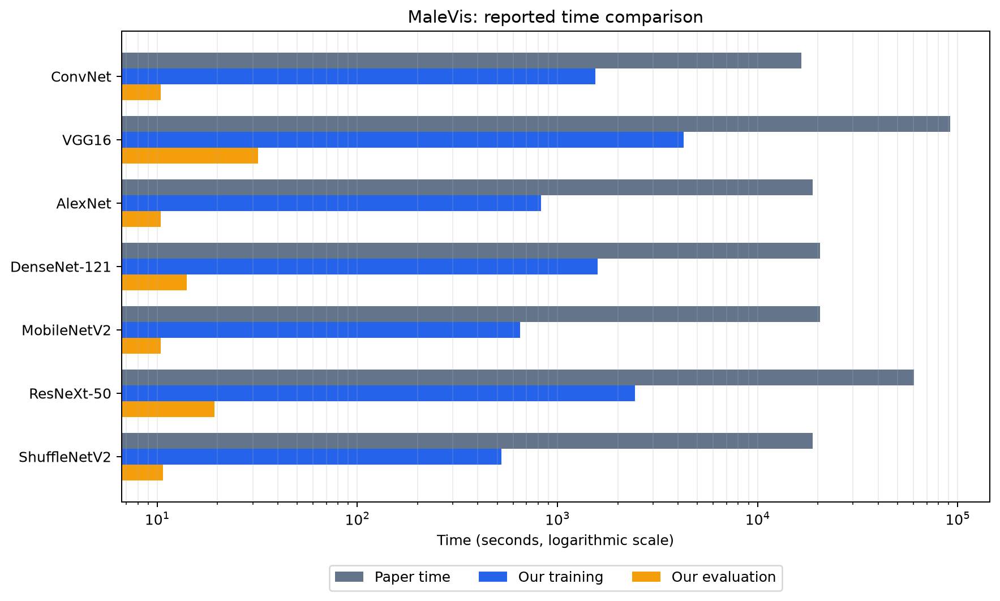

Additional quality metrics from our run

| Model        | Balanced Acc. (%) | Macro P | Macro R | Macro F1 | Weighted F1 | MCC   | Kappa |
| ------------ | ----------------- | ------- | ------- | -------- | ----------- | ----- | ----- |
| ConvNet      | 93.95             | 0.862   | 0.940   | 0.891    | 0.850       | 0.843 | 0.835 |
| VGG16        | 95.55             | 0.891   | 0.955   | 0.915    | 0.881       | 0.871 | 0.865 |
| AlexNet      | 93.42             | 0.876   | 0.934   | 0.895    | 0.860       | 0.847 | 0.840 |
| DenseNet-121 | 92.62             | 0.863   | 0.926   | 0.884    | 0.845       | 0.833 | 0.826 |
| MobileNetV2  | 82.53             | 0.788   | 0.825   | 0.771    | 0.726       | 0.718 | 0.705 |
| ResNeXt-50   | 84.88             | 0.806   | 0.849   | 0.810    | 0.781       | 0.762 | 0.754 |
| ShuffleNetV2 | 62.67             | 0.550   | 0.627   | 0.531    | 0.440       | 0.495 | 0.472 |

### Blended

| Model        | Paper accuracy (%) | Our accuracy (%) | Δ Accuracy | Paper Time (s) | Our training (s) | Δ Time* | Our evaluation (s) | Paper improvement over ConvNet | Our evaluation improvement over ConvNet | Scope                                 |
| ------------ | ------------------ | ---------------- | ---------- | -------------- | ---------------- | ------- | ------------------ | ------------------------------ | --------------------------------------- | ------------------------------------- |
| ConvNet      | 91.39              | 95.51            | +4.12 pp   | 18855.47       | 1682.07          | -91.08% | 7.52               | —                              | —                                       | Same dataset name; different protocol |
| VGG16        | 83.71              | 96.29            | +12.58 pp  | 108910.73      | 4645.33          | -95.73% | 24.30              | 82.69%                         | 69.05%                                  | Same dataset name; different protocol |
| AlexNet      | 90.57              | 95.46            | +4.89 pp   | 20818.47       | 897.64           | -95.69% | 7.58               | 9.42%                          | 0.75%                                   | Same dataset name; different protocol |
| DenseNet-121 | 91.22              | 94.35            | +3.13 pp   | 62622.49       | 1726.69          | -97.24% | 10.70              | 69.90%                         | 29.75%                                  | Same dataset name; different protocol |
| MobileNetV2  | 91.03              | 85.02            | -6.01 pp   | 23570.72       | 719.98           | -96.95% | 8.60               | 20.01%                         | 12.58%                                  | Same dataset name; different protocol |
| ResNeXt-50   | 90.14              | 85.51            | -4.63 pp   | 68743.93       | 2653.81          | -96.14% | 14.62              | 72.58%                         | 48.55%                                  | Same dataset name; different protocol |
| ShuffleNetV2 | 91.32              | 65.79            | -25.53 pp  | 22139.80       | 581.98           | -97.37% | 7.66               | 14.80%                         | 1.82%                                   | Same dataset name; different protocol |

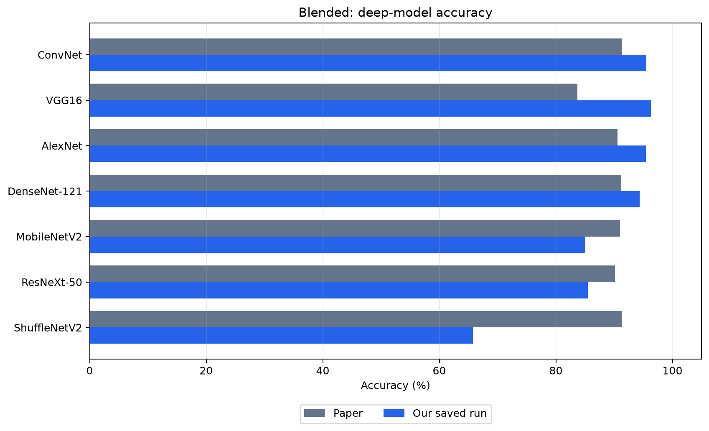

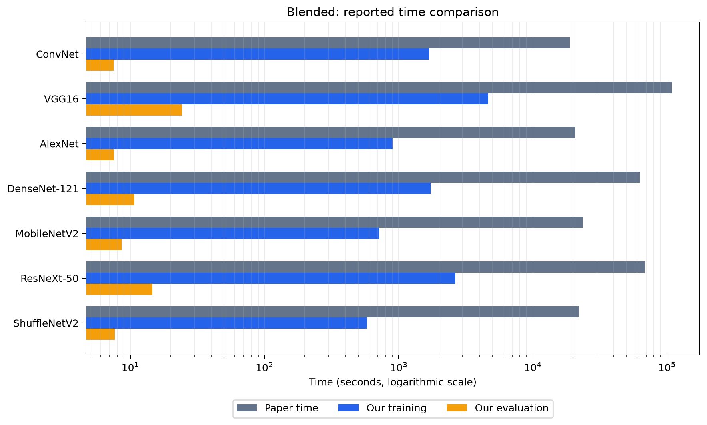

Additional quality metrics from our run

| Model        | Balanced Acc. (%) | Macro P | Macro R | Macro F1 | Weighted F1 | MCC   | Kappa |
| ------------ | ----------------- | ------- | ------- | -------- | ----------- | ----- | ----- |
| ConvNet      | 96.08             | 0.961   | 0.961   | 0.961    | 0.955       | 0.953 | 0.953 |
| VGG16        | 96.76             | 0.968   | 0.968   | 0.967    | 0.963       | 0.962 | 0.961 |
| AlexNet      | 96.03             | 0.961   | 0.960   | 0.961    | 0.955       | 0.953 | 0.953 |
| DenseNet-121 | 95.06             | 0.956   | 0.951   | 0.952    | 0.945       | 0.942 | 0.941 |
| MobileNetV2  | 86.91             | 0.894   | 0.869   | 0.860    | 0.840       | 0.846 | 0.845 |
| ResNeXt-50   | 87.47             | 0.896   | 0.875   | 0.869    | 0.849       | 0.851 | 0.850 |
| ShuffleNetV2 | 70.11             | 0.707   | 0.701   | 0.657    | 0.607       | 0.651 | 0.645 |

### MaleVis without the Other class

This run is our only saved result for this subset; no results for the other models exist in the `results` folder, so no rows have been created for them.

| Model   | Paper accuracy (%) | Our accuracy (%) | Δ Accuracy | Paper Time (s) | Our training (s) | Δ Time* | Our evaluation (s) | Balanced Acc. (%) | Macro F1 |
| ------- | ------------------ | ---------------- | ---------- | -------------- | ---------------- | ------- | ------------------ | ----------------- | -------- |
| ConvNet | 96.76              | 95.36            | -1.40 pp   | 16539.89       | 1482.60          | -91.04% | 6.80               | 95.34             | 0.953    |

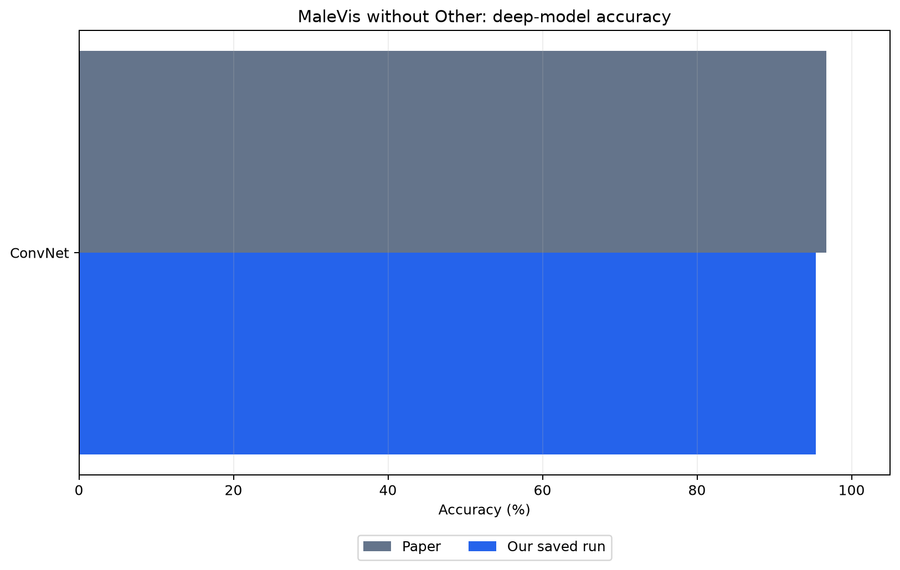

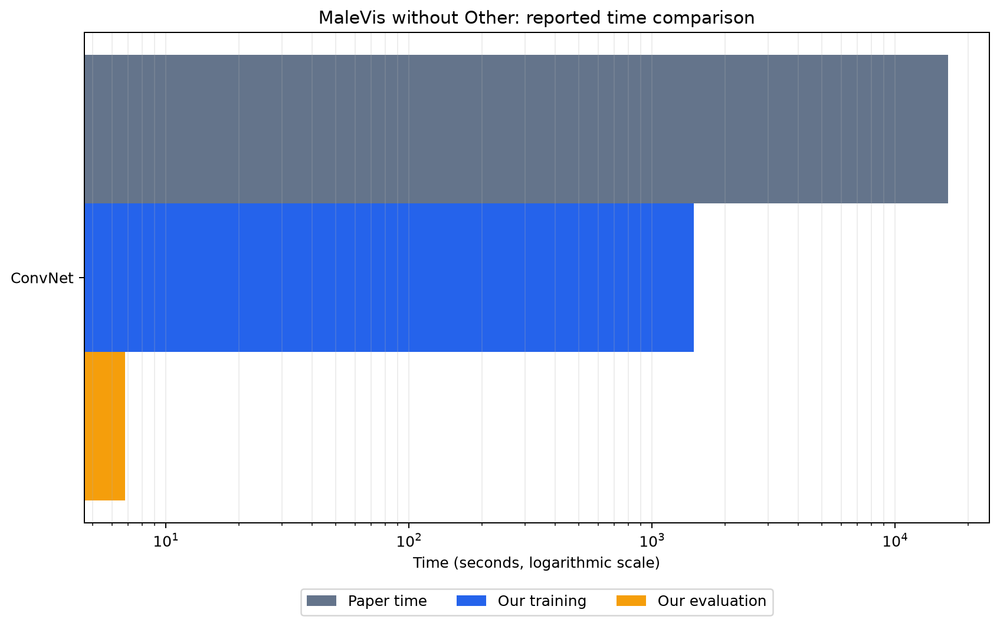

† The marked MaleVis comparisons do not cover the same scope and should not be interpreted as definitive superiority or weakness of a model.

## 2. GLCM Models: All Models and Both Variants

For each dataset, the paper’s accuracy is first shown alongside both of our results. Then, all of our recorded metrics and times are provided in the expandable section. `—` in the time column means that the cached run did not store the time, not that the time was zero.

### Malimg - GLCM Accuracy Comparison

| Model              | Paper (%) | Our raw (%) | Δ raw     | Our balanced+aug (%) | Δ balanced+aug | Effect of augmentation in our results |
| ------------------ | --------- | ----------- | --------- | -------------------- | -------------- | ------------------------------------- |
| LogisticRegression | 29.01     | 89.26       | +60.25 pp | 38.78                | +9.77 pp       | -50.48 pp                             |
| GaussianNB         | 68.82     | 90.76       | +21.94 pp | 44.25                | -24.57 pp      | -46.51 pp                             |
| KNN                | 59.42     | 96.78       | +37.36 pp | 64.12                | +4.70 pp       | -32.65 pp                             |
| DecisionTree       | 90.71     | 96.46       | +5.75 pp  | 52.20                | -38.51 pp      | -44.25 pp                             |
| RandomForest       | 91.15     | 97.42       | +6.27 pp  | 64.77                | -26.38 pp      | -32.65 pp                             |
| GradientBoosting   | 91.36     | 97.21       | +5.85 pp  | 53.60                | -37.76 pp      | -43.61 pp                             |
| XGBoost            | 92.37     | 97.42       | +5.05 pp  | 62.19                | -30.18 pp      | -35.23 pp                             |
| LightGBM           | —         | 97.96       | —         | 63.27                | —              | -34.69 pp                             |
| SVM                | —         | 89.69       | —         | 58.75                | —              | -30.93 pp                             |
| MLP                | —         | 96.13       | —         | 59.40                | —              | -36.73 pp                             |

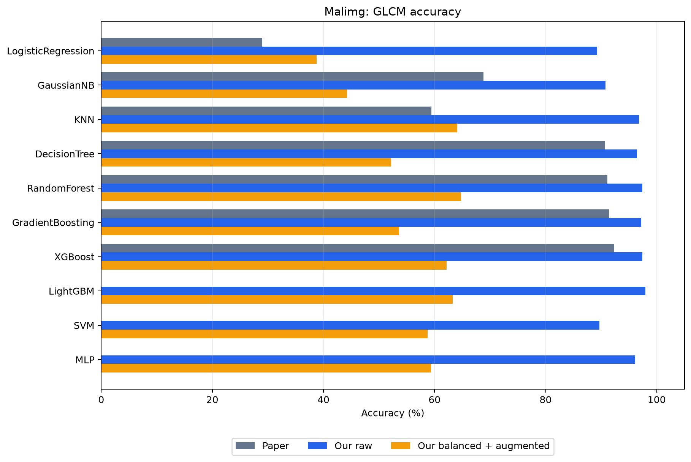

All GLCM metrics and times for this dataset

| Model              | variant            | Balanced Acc. (%) | Macro P | Macro R | Macro F1 | Weighted F1 | MCC   | Kappa | Training (s) | Evaluation (s) |
| ------------------ | ------------------ | ----------------- | ------- | ------- | -------- | ----------- | ----- | ----- | ------------ | -------------- |
| LogisticRegression | raw                | 70.26             | 0.732   | 0.703   | 0.704    | 0.868       | 0.875 | 0.873 | —            | —              |
| LogisticRegression | balanced-augmented | 50.78             | 0.444   | 0.508   | 0.422    | 0.405       | 0.341 | 0.327 | —            | —              |
| GaussianNB         | raw                | 81.95             | 0.841   | 0.820   | 0.804    | 0.899       | 0.892 | 0.892 | —            | —              |
| GaussianNB         | balanced-augmented | 35.96             | 0.383   | 0.360   | 0.348    | 0.380       | 0.346 | 0.330 | —            | —              |
| KNN                | raw                | 92.32             | 0.919   | 0.923   | 0.918    | 0.966       | 0.962 | 0.962 | —            | —              |
| KNN                | balanced-augmented | 60.40             | 0.522   | 0.604   | 0.535    | 0.556       | 0.591 | 0.567 | —            | —              |
| DecisionTree       | raw                | 92.12             | 0.923   | 0.921   | 0.921    | 0.965       | 0.958 | 0.958 | —            | —              |
| DecisionTree       | balanced-augmented | 52.98             | 0.502   | 0.530   | 0.479    | 0.517       | 0.487 | 0.465 | —            | —              |
| RandomForest       | raw                | 93.51             | 0.937   | 0.935   | 0.935    | 0.973       | 0.970 | 0.970 | —            | —              |
| RandomForest       | balanced-augmented | 61.82             | 0.534   | 0.618   | 0.525    | 0.642       | 0.616 | 0.602 | —            | —              |
| GradientBoosting   | raw                | 93.29             | 0.934   | 0.933   | 0.932    | 0.972       | 0.967 | 0.967 | —            | —              |
| GradientBoosting   | balanced-augmented | 54.78             | 0.462   | 0.548   | 0.467    | 0.453       | 0.469 | 0.446 | —            | —              |
| XGBoost            | raw                | 93.40             | 0.941   | 0.934   | 0.936    | 0.974       | 0.970 | 0.970 | —            | —              |
| XGBoost            | balanced-augmented | 57.15             | 0.495   | 0.571   | 0.488    | 0.618       | 0.585 | 0.573 | —            | —              |
| LightGBM           | raw                | 94.85             | 0.950   | 0.949   | 0.949    | 0.980       | 0.976 | 0.976 | —            | —              |
| LightGBM           | balanced-augmented | 55.90             | 0.527   | 0.559   | 0.505    | 0.616       | 0.591 | 0.578 | —            | —              |
| SVM                | raw                | 72.13             | 0.748   | 0.721   | 0.714    | 0.876       | 0.879 | 0.878 | —            | —              |
| SVM                | balanced-augmented | 58.19             | 0.558   | 0.582   | 0.504    | 0.570       | 0.548 | 0.530 | —            | —              |
| MLP                | raw                | 89.34             | 0.900   | 0.893   | 0.885    | 0.953       | 0.955 | 0.955 | —            | —              |
| MLP                | balanced-augmented | 64.61             | 0.585   | 0.646   | 0.583    | 0.513       | 0.542 | 0.514 | —            | —              |

### BIG2015 - GLCM Accuracy Comparison

| Model              | Paper (%) | Our raw (%) | Δ raw     | Our balanced+aug (%) | Δ balanced+aug | Effect of augmentation in our results |
| ------------------ | --------- | ----------- | --------- | -------------------- | -------------- | ------------------------------------- |
| LogisticRegression | 67.47     | 78.44       | +10.97 pp | 72.28                | +4.81 pp       | -6.16 pp                              |
| GaussianNB         | 69.91     | 70.22       | +0.31 pp  | 62.37                | -7.54 pp       | -7.85 pp                              |
| KNN                | 65.82     | 91.57       | +25.75 pp | 81.29                | +15.47 pp      | -10.27 pp                             |
| DecisionTree       | 92.51     | 91.38       | -1.13 pp  | 80.62                | -11.89 pp      | -10.76 pp                             |
| RandomForest       | 95.10     | 94.05       | -1.05 pp  | 86.26                | -8.84 pp       | -7.79 pp                              |
| GradientBoosting   | 91.92     | 91.81       | -0.11 pp  | 83.81                | -8.11 pp       | -8.00 pp                              |
| XGBoost            | 94.30     | 93.56       | -0.74 pp  | 86.26                | -8.04 pp       | -7.30 pp                              |
| LightGBM           | —         | 93.96       | —         | 85.71                | —              | -8.25 pp                              |
| SVM                | —         | 85.89       | —         | 80.01                | —              | -5.89 pp                              |
| MLP                | —         | 90.74       | —         | 85.62                | —              | -5.12 pp                              |

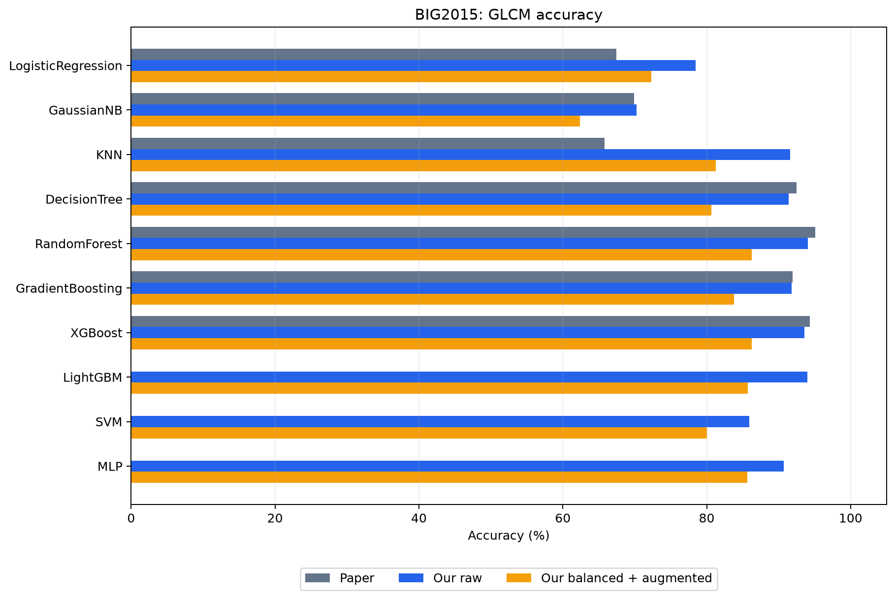

All GLCM metrics and times for this dataset

| Model              | variant            | Balanced Acc. (%) | Macro P | Macro R | Macro F1 | Weighted F1 | MCC   | Kappa | Training (s) | Evaluation (s) |
| ------------------ | ------------------ | ----------------- | ------- | ------- | -------- | ----------- | ----- | ----- | ------------ | -------------- |
| LogisticRegression | raw                | 62.31             | 0.647   | 0.623   | 0.630    | 0.772       | 0.737 | 0.736 | 1.77         | 0.00           |
| LogisticRegression | balanced-augmented | 66.91             | 0.628   | 0.669   | 0.607    | 0.721       | 0.675 | 0.667 | 2.18         | 0.00           |
| GaussianNB         | raw                | 60.12             | 0.529   | 0.601   | 0.519    | 0.659       | 0.645 | 0.636 | 0.00         | 0.00           |
| GaussianNB         | balanced-augmented | 56.95             | 0.500   | 0.570   | 0.472    | 0.612       | 0.569 | 0.554 | 0.00         | 0.00           |
| KNN                | raw                | 81.70             | 0.863   | 0.817   | 0.822    | 0.915       | 0.898 | 0.898 | 0.01         | 0.07           |
| KNN                | balanced-augmented | 81.06             | 0.726   | 0.811   | 0.744    | 0.820       | 0.778 | 0.776 | 0.00         | 0.06           |
| DecisionTree       | raw                | 86.33             | 0.883   | 0.863   | 0.872    | 0.913       | 0.895 | 0.895 | 0.05         | 0.00           |
| DecisionTree       | balanced-augmented | 78.15             | 0.716   | 0.781   | 0.729    | 0.812       | 0.769 | 0.767 | 0.04         | 0.00           |
| RandomForest       | raw                | 85.80             | 0.934   | 0.858   | 0.875    | 0.940       | 0.928 | 0.928 | 0.18         | 0.05           |
| RandomForest       | balanced-augmented | 82.66             | 0.766   | 0.827   | 0.775    | 0.868       | 0.836 | 0.835 | 0.18         | 0.05           |
| GradientBoosting   | raw                | 81.47             | 0.832   | 0.815   | 0.821    | 0.917       | 0.901 | 0.901 | 11.41        | 0.04           |
| GradientBoosting   | balanced-augmented | 82.02             | 0.743   | 0.820   | 0.753    | 0.845       | 0.807 | 0.805 | 11.13        | 0.05           |
| XGBoost            | raw                | 84.54             | 0.925   | 0.845   | 0.859    | 0.935       | 0.922 | 0.922 | 0.71         | 0.06           |
| XGBoost            | balanced-augmented | 83.93             | 0.793   | 0.839   | 0.810    | 0.866       | 0.835 | 0.834 | 2.95         | 0.01           |
| LightGBM           | raw                | 85.70             | 0.932   | 0.857   | 0.874    | 0.939       | 0.927 | 0.927 | 2.39         | 0.03           |
| LightGBM           | balanced-augmented | 83.41             | 0.791   | 0.834   | 0.806    | 0.860       | 0.829 | 0.828 | 2.25         | 0.03           |
| SVM                | raw                | 73.07             | 0.726   | 0.731   | 0.726    | 0.855       | 0.829 | 0.829 | 1.07         | 0.39           |
| SVM                | balanced-augmented | 77.40             | 0.702   | 0.774   | 0.699    | 0.807       | 0.765 | 0.760 | 1.40         | 0.58           |
| MLP                | raw                | 84.40             | 0.896   | 0.844   | 0.861    | 0.906       | 0.888 | 0.888 | 5.39         | 0.00           |
| MLP                | balanced-augmented | 85.69             | 0.783   | 0.857   | 0.804    | 0.860       | 0.829 | 0.827 | 5.48         | 0.00           |

### Malevis - GLCM Accuracy Comparison

| Model              | Paper (%) | Our raw (%) | Δ raw     | Our balanced+aug (%) | Δ balanced+aug | Effect of augmentation in our results |
| ------------------ | --------- | ----------- | --------- | -------------------- | -------------- | ------------------------------------- |
| LogisticRegression | 47.23     | 42.78       | -4.45 pp  | 32.03                | -15.20 pp      | -10.75 pp                             |
| GaussianNB         | 52.21     | 38.72       | -13.49 pp | 29.71                | -22.50 pp      | -9.01 pp                              |
| KNN                | 64.52     | 68.86       | +4.34 pp  | 56.28                | -8.24 pp       | -12.58 pp                             |
| DecisionTree       | 87.23     | 70.04       | -17.19 pp | 40.79                | -46.44 pp      | -29.24 pp                             |
| RandomForest       | 89.12     | 74.93       | -14.19 pp | 57.00                | -32.12 pp      | -17.93 pp                             |
| GradientBoosting   | 86.06     | 70.21       | -15.85 pp | 47.64                | -38.42 pp      | -22.57 pp                             |
| XGBoost            | 88.33     | 73.74       | -14.59 pp | 50.82                | -37.51 pp      | -22.92 pp                             |
| LightGBM           | —         | 74.37       | —         | 49.90                | —              | -24.46 pp                             |
| SVM                | —         | 51.64       | —         | 44.40                | —              | -7.24 pp                              |
| MLP                | —         | 63.66       | —         | 52.59                | —              | -11.06 pp                             |

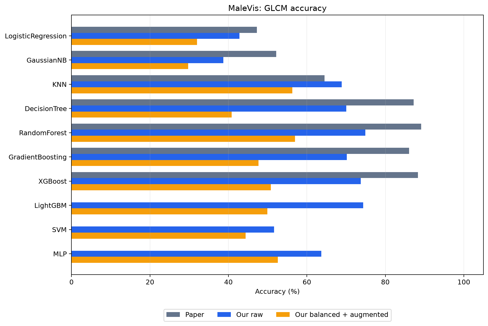

All GLCM metrics and times for this dataset

| Model              | variant            | Balanced Acc. (%) | Macro P | Macro R | Macro F1 | Weighted F1 | MCC   | Kappa | Training (s) | Evaluation (s) |
| ------------------ | ------------------ | ----------------- | ------- | ------- | -------- | ----------- | ----- | ----- | ------------ | -------------- |
| LogisticRegression | raw                | 55.16             | 0.430   | 0.552   | 0.433    | 0.350       | 0.425 | 0.406 | —            | —              |
| LogisticRegression | balanced-augmented | 39.97             | 0.313   | 0.400   | 0.302    | 0.262       | 0.309 | 0.293 | 6.90         | 0.03           |
| GaussianNB         | raw                | 51.11             | 0.411   | 0.511   | 0.412    | 0.316       | 0.394 | 0.368 | —            | —              |
| GaussianNB         | balanced-augmented | 38.72             | 0.287   | 0.387   | 0.268    | 0.213       | 0.298 | 0.275 | 0.00         | 0.01           |
| KNN                | raw                | 83.75             | 0.723   | 0.838   | 0.762    | 0.671       | 0.688 | 0.672 | —            | —              |
| KNN                | balanced-augmented | 70.81             | 0.584   | 0.708   | 0.617    | 0.522       | 0.563 | 0.544 | 0.00         | 0.11           |
| DecisionTree       | raw                | 84.45             | 0.755   | 0.845   | 0.783    | 0.693       | 0.700 | 0.684 | —            | —              |
| DecisionTree       | balanced-augmented | 48.53             | 0.472   | 0.485   | 0.460    | 0.417       | 0.390 | 0.377 | 0.07         | 0.00           |
| RandomForest       | raw                | 87.53             | 0.797   | 0.875   | 0.824    | 0.751       | 0.745 | 0.733 | —            | —              |
| RandomForest       | balanced-augmented | 67.88             | 0.596   | 0.679   | 0.617    | 0.559       | 0.560 | 0.546 | 0.27         | 0.12           |
| GradientBoosting   | raw                | 84.03             | 0.755   | 0.840   | 0.782    | 0.698       | 0.700 | 0.685 | —            | —              |
| GradientBoosting   | balanced-augmented | 56.85             | 0.481   | 0.568   | 0.501    | 0.458       | 0.462 | 0.449 | 42.19        | 0.16           |
| XGBoost            | raw                | 86.57             | 0.797   | 0.866   | 0.818    | 0.741       | 0.734 | 0.721 | —            | —              |
| XGBoost            | balanced-augmented | 59.77             | 0.527   | 0.598   | 0.538    | 0.495       | 0.492 | 0.480 | 21.85        | 0.04           |
| LightGBM           | raw                | 86.92             | 0.808   | 0.869   | 0.825    | 0.751       | 0.740 | 0.727 | —            | —              |
| LightGBM           | balanced-augmented | 58.57             | 0.533   | 0.586   | 0.537    | 0.494       | 0.481 | 0.469 | 10.89        | 0.15           |
| SVM                | raw                | 65.54             | 0.529   | 0.655   | 0.551    | 0.458       | 0.513 | 0.495 | —            | —              |
| SVM                | balanced-augmented | 57.03             | 0.439   | 0.570   | 0.459    | 0.375       | 0.441 | 0.422 | 4.24         | 2.16           |
| MLP                | raw                | 78.94             | 0.667   | 0.789   | 0.705    | 0.607       | 0.638 | 0.619 | —            | —              |
| MLP                | balanced-augmented | 68.78             | 0.558   | 0.688   | 0.590    | 0.467       | 0.531 | 0.509 | 30.87        | 0.04           |

### Blended - GLCM Accuracy Comparison

| Model              | Paper (%) | Our raw (%) | Δ raw     | Our balanced+aug (%) | Δ balanced+aug | Effect of augmentation in our results |
| ------------------ | --------- | ----------- | --------- | -------------------- | -------------- | ------------------------------------- |
| LogisticRegression | 49.71     | 57.46       | +7.75 pp  | 40.45                | -9.26 pp       | -17.01 pp                             |
| GaussianNB         | 48.67     | 52.85       | +4.18 pp  | 40.11                | -8.56 pp       | -12.74 pp                             |
| KNN                | 64.16     | 86.54       | +22.38 pp | 73.06                | +8.90 pp       | -13.48 pp                             |
| DecisionTree       | 87.44     | 87.11       | -0.33 pp  | 55.50                | -31.94 pp      | -31.61 pp                             |
| RandomForest       | 89.70     | 90.44       | +0.74 pp  | 72.11                | -17.59 pp      | -18.33 pp                             |
| GradientBoosting   | 87.01     | 86.57       | -0.44 pp  | 58.60                | -28.41 pp      | -27.97 pp                             |
| XGBoost            | 88.60     | 89.33       | +0.73 pp  | 61.67                | -26.93 pp      | -27.66 pp                             |
| LightGBM           | —         | 89.40       | —         | 59.81                | —              | -29.60 pp                             |
| SVM                | —         | 66.54       | —         | 58.34                | —              | -8.20 pp                              |
| MLP                | —         | 80.64       | —         | 68.19                | —              | -12.45 pp                             |

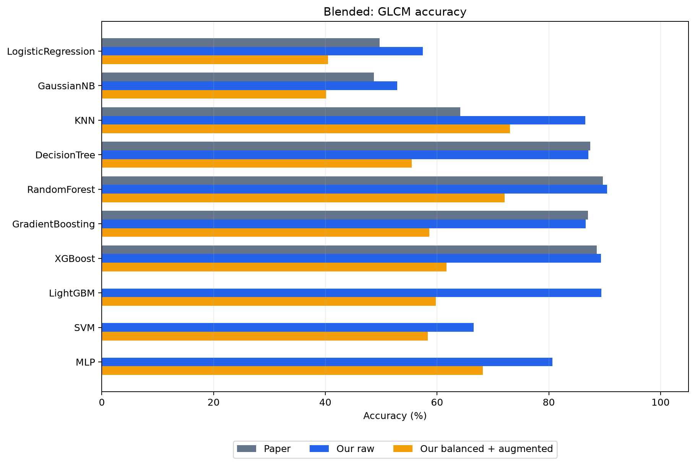

All GLCM metrics and times for this dataset

| Model              | variant            | Balanced Acc. (%) | Macro P | Macro R | Macro F1 | Weighted F1 | MCC   | Kappa | Training (s) | Evaluation (s) |
| ------------------ | ------------------ | ----------------- | ------- | ------- | -------- | ----------- | ----- | ----- | ------------ | -------------- |
| LogisticRegression | raw                | 57.27             | 0.528   | 0.573   | 0.511    | 0.511       | 0.562 | 0.559 | 9.32         | 0.02           |
| LogisticRegression | balanced-augmented | 44.30             | 0.394   | 0.443   | 0.359    | 0.334       | 0.389 | 0.383 | 12.28        | 0.00           |
| GaussianNB         | raw                | 58.03             | 0.470   | 0.580   | 0.488    | 0.466       | 0.518 | 0.512 | 0.00         | 0.01           |
| GaussianNB         | balanced-augmented | 42.49             | 0.336   | 0.425   | 0.331    | 0.322       | 0.388 | 0.380 | 0.00         | 0.01           |
| KNN                | raw                | 87.97             | 0.853   | 0.880   | 0.862    | 0.858       | 0.861 | 0.860 | 0.00         | 0.08           |
| KNN                | balanced-augmented | 73.30             | 0.706   | 0.733   | 0.704    | 0.708       | 0.722 | 0.721 | 0.01         | 0.10           |
| DecisionTree       | raw                | 87.94             | 0.868   | 0.879   | 0.872    | 0.868       | 0.866 | 0.866 | 0.07         | 0.00           |
| DecisionTree       | balanced-augmented | 52.07             | 0.556   | 0.521   | 0.514    | 0.554       | 0.541 | 0.539 | 0.07         | 0.00           |
| RandomForest       | raw                | 91.37             | 0.902   | 0.914   | 0.906    | 0.903       | 0.901 | 0.901 | 0.27         | 0.11           |
| RandomForest       | balanced-augmented | 69.72             | 0.684   | 0.697   | 0.675    | 0.717       | 0.711 | 0.711 | 0.29         | 0.13           |
| GradientBoosting   | raw                | 87.69             | 0.868   | 0.877   | 0.870    | 0.865       | 0.861 | 0.861 | 48.10        | 0.12           |
| GradientBoosting   | balanced-augmented | 57.22             | 0.541   | 0.572   | 0.541    | 0.576       | 0.573 | 0.571 | 59.24        | 0.14           |
| XGBoost            | raw                | 90.15             | 0.895   | 0.902   | 0.898    | 0.893       | 0.889 | 0.889 | 13.20        | 0.08           |
| XGBoost            | balanced-augmented | 62.79             | 0.630   | 0.628   | 0.617    | 0.613       | 0.606 | 0.602 | 7.06         | 0.05           |
| LightGBM           | raw                | 89.90             | 0.896   | 0.899   | 0.897    | 0.895       | 0.890 | 0.890 | 10.46        | 0.15           |
| LightGBM           | balanced-augmented | 61.00             | 0.643   | 0.610   | 0.613    | 0.603       | 0.587 | 0.583 | 9.36         | 0.13           |
| SVM                | raw                | 67.85             | 0.634   | 0.678   | 0.623    | 0.627       | 0.656 | 0.653 | 3.03         | 1.70           |
| SVM                | balanced-augmented | 57.84             | 0.555   | 0.578   | 0.516    | 0.531       | 0.572 | 0.568 | 4.81         | 2.19           |
| MLP                | raw                | 82.56             | 0.796   | 0.826   | 0.803    | 0.796       | 0.800 | 0.799 | 57.06        | 0.03           |
| MLP                | balanced-augmented | 66.00             | 0.645   | 0.660   | 0.633    | 0.656       | 0.671 | 0.670 | 49.18        | 0.02           |

## Summary of Results

* Our best saved accuracy on Malimg is **99.36% with DenseNet-121**, on BIG2015 it is **98.41% with VGG16**, on MaleVis including `Other` it is **87.59% with VGG16**, and on Blended it is **96.29% with VGG16**.
* Our ConvNet is higher than the corresponding paper value on Malimg, BIG2015, MaleVis including `Other`, and Blended by **+3.85, +0.96, +1.52, and +4.12 pp**, respectively; on MaleVis without `Other`, it is **-1.40 pp** lower.
* In our GLCM branch, the raw variant outperforms the balanced+augmented variant on all four datasets. Therefore, image augmentation in this setting was not beneficial for low-dimensional texture features.
* Our times appear much shorter than those reported in the paper’s table, but because of differences in epoch, image size, batch, hardware, and ambiguity in the definition of the paper’s `Time` column, this difference should not be reported as a definitive speedup.
* The accuracy drop of the deep models on MaleVis is mainly associated with the presence of the heterogeneous `Other` class; the comparison between Table 3 of the paper and our pretrained models on this dataset does not cover the same scope.
